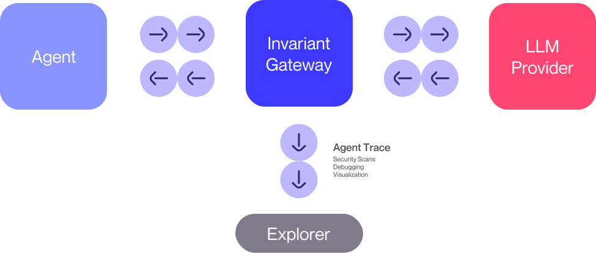

# Getting Started With Gateway

<div class='subtitle'>LLM proxy to observe and debug what your AI agents are doing</div>

[Invariant Gateway](https://github.com/invariantlabs-ai/invariant-gateway) is a lightweight _zero-configuration_ service that acts as an intermediary between AI Agents and LLM providers (such as OpenAI and Anthropic).

Gateway automatically traces agent interactions and stores them in the [Invariant Explorer](https://explorer.invariantlabs.ai/), giving you insights into what your agents are doing.
This enables you to _observe and debug_ your agents in [Invariant Explorer](https://explorer.invariantlabs.ai/).



## Quick Example with OpenAI

### 1. Getting the Invariant API Key

Navigate to the  [Invariant Explorer](https://explorer.invariantlabs.ai) and create an account via GitHub Sign-In.

Once you have created an account, go to your [User Settings](https://explorer.invariantlabs.ai/settings) and generate an API key.

### 2. Setup OpenAI API Key

```bash
export OPENAI_API_KEY={your-openai-api-key}
```

### 3. Code

```python
http_client = Client(
    headers={
        "Invariant-Authorization": "Bearer {your-invariant-api-key}"
    },
)
openai = OpenAI(
    http_client=http_client,
    base_url="https://explorer.invariantlabs.ai/api/v1/gateway/{your-dataset-name}/openai",
)

result = openai.chat.completions.create(
    model="gpt-4",
    messages=[
        {"role": "user", "content": "What is the capital of France?"},
    ],
)
print("result: ", result)
```

This would push your trace to the [Invariant Explorer](https://explorer.invariantlabs.ai/) where it will be available in the dataset name used above.