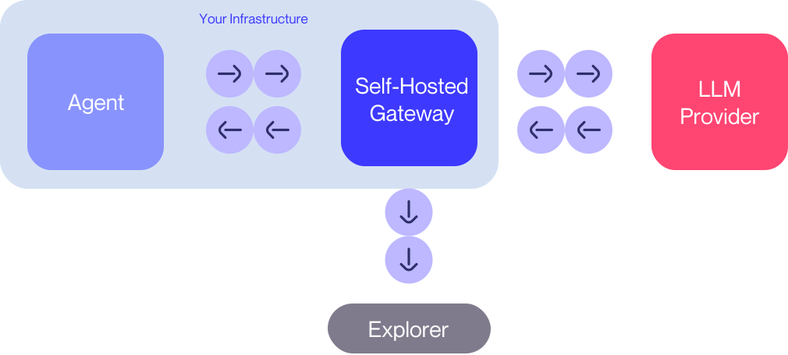

<div class='subtitle'>Operate your own Gateway instance</div>

Apart from using our hosted offering, you can also self-host the Invariant Gateway, to enable secure and observable agentic applications within your organization.

This can be favorable if you want to run the Gateway on your own infrastructure, and have more control over the environment, e.g. to comply with your organization's security policies.

<br/>



<br/>

## Prerequisites

Before you get started, you have to ensure that your system has [Docker](https://docs.docker.com/get-docker/) installed.

```bash
git clone git@github.com:invariantlabs-ai/invariant-gateway.git
```

Then, navigate to the cloned directory:

```bash
cd invariant-gateway
```

## Launching

After preparing the repository, you can launch the Gateway as a Docker container on your system via the provided `run.sh` script:

```bash
bash run.sh build && bash run.sh up
```

This will launch a Gateway service at `http://localhost:8005/api/v1/gateway/` of the resulting container, allowing you to use and integrate Gateway with your own network infrastructure.

## Stopping

To stop the service, you can run the following command, which will stop and remove the container:

```bash
bash run.sh down
```

## Configuration

You can also configure your self-hosted Gateway instance, e.g. to use a different Explorer instance to interact with or to change other settings.

To learn more about different configuration options, please see the [Gateway README](https://github.com/invariantlabs-ai/invariant-gateway/blob/main/README.md).

## Usage

After launching the Gateway, you can use it in the same way as the hosted version, relying on the base URL of your Gateway instance instead of the hosted URL.

Consider any of the following chapters next, to learn more about how to integrate Gateway:

<div class='tiles'>

<a href="../llm-provider-integrations/openai" class='tile primary'>
    <span class='tile-title'>OpenAI Integration →</span>
    <span class='tile-description'>Seamlessly connect to OpenAI APIs through the Invariant Gateway.</span>
</a>

<a href="../llm-provider-integrations/anthropic" class='tile primary'>
    <span class='tile-title'>Anthropic Integration →</span>
    <span class='tile-description'>Leverage the Invariant Gateway for smooth Anthropic API interactions.</span>
</a>

<a href="../agent-integrations/openhands" class='tile'>
    <span class='tile-title'>OpenHands Integration →</span>
    <span class='tile-description'>Enhance and debug your OpenHands agents effortlessly using the Gateway.</span>
</a>

<a href="../agent-integrations/swe-agent" class='tile'>
    <span class='tile-title'>SWE-agent Integration →</span>
    <span class='tile-description'>Streamline the development and debugging of SWE-agent applications with the Gateway.</span>
</a>

<a href="../agent-integrations/browser-use" class='tile'>
    <span class='tile-title'>Browser Use Integration →</span>
    <span class='tile-description'>Optimize and troubleshoot your Browser Use applications with Invariant Gateway.</span>
</a>

</div>
