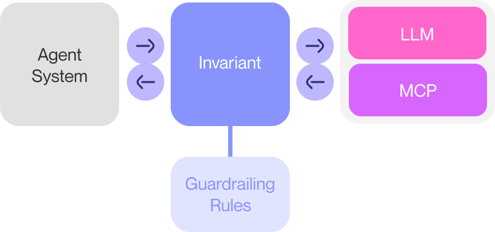

# Invariant Agent Security

<div class='subtitle'>
High-precision guardrailing for agentic AI systems.
</div>

Invariant is a **security layer to protect agentic AI systems**. It helps you to prevent prompt injections, data leaks, steers your agent, and ensures strict compliance with behavioral and security policies for your AI systems.

You can **deploy Invariant within minutes using our hosted LLM-level gateway**, to ensure quick response to agent security incidents and to get your agent ready for production.

### How Invariant Works

Invariant acts as a transparent layer between your agent system and the LLM and tool providers. It intercepts all LLM calls and tool actions, and applies steering rules according to a provided guardrailing policies.

Policies are defined in terms of both [deterministic and fuzzy rules](./guardrails/). During operation, your agent is continuously evaluated against them, to restrict its behavior to prevent malfunction and abuse.

Invariant does not require invasive code changes, and can be used with any model, agent, framework and tooling. It is designed to be easy to use and integrate into your existing stack, right from the beginning or when _you_ are ready to ship.

<br/><br/>

<br/><br/>

In this setup, an example Invariant rule for safeguarding against leakage flows looks like this:

```python
raise "agent leaks internal data" if:
    # check all flows between tool calls
    (output: ToolOutput) -> (call: ToolCall)
    # detects sensitive data in the first output
    is_sensitive(output.content)
    # detects a potentially sensitive action like sending an email
    call is tool:send_email
```

Many security rules like these ship out-of-the-box with Invariant, and you can easily define your own rules to suit your needs and policies.

This documentation describes how to set up Invariant and the relevant guardrailing rules for your agent systems such that you can secure your agents and prevent them from engaging in malicious behavior.

<div class='tiles'>
<a href="#getting-started-as-developer" class='tile primary'>
    <span class='tile-title'>Get Started As Developer →</span>
    <span class='tile-description'>Deploy your first guardrailing rules with Gateway</span>
</a>
</div>

## Why You Need A Security Layer for Agents

Invariant helps you make sure that your agents are safe from malicious actors and prevents fatal malfunction:

* It **blocks [prompt injections and agent jailbreaks](./guardrails/prompt-injections.md)**.
* It **imposes [strict rules on agent capabilities](./guardrails/index.md)** and behavior, to prevent malfunction and abuse.
* It constantly **analyzes the [data flow of your agents](./guardrails/dataflow-rules.md)**, to ensure that they are not leaking sensitive information or engaging in off-policy behavior.
* It ensures that your agents are **in [compliance with your organization's policies](./guardrails/tool-calls.md)**.
* It helps you to **[surface novel malicious behavioral patterns](./guardrails/explorer.md)** in your agents, and automatically proposes guardrailing rules to prevent them.

Securing your agent is a crucial step in safely deploying AI agents to production for public or internal use, and ensuring that they behave as expected.


## Getting Started as Developer

The _Invariant_ **intercepts the LLM and MCP calls of your agent**, to implement _steering and guardrailing_, without requiring major code changes:

<br/>
<div class='overview'>
    <div class='clear box thirdparty'>
        Agent
    </div>
    ↔
    <div class='box fill main clear'>
        <a class='box clear' href='./gateway'>
            <p>Invariant Gateway <i class='more'>↗</i></p>
            <i>Security proxy to intercept LLM and tool calls</i>
        </a>
    </div>
    ↔
    <div class='clear box thirdparty'>
        LLM Provider
    </div>
</div>
<br/>

To quickly secure your agentic application with Invariant, you can rely on our hosted LLM-level gateway. It automatically traces and protects your agent's LLM calls and actions by enforcing guardrailing rules.

---

**:bootstrap-1-circle: Sign Up for Invariant**

Go to  [Invariant Explorer](https://explorer.invariantlabs.ai), sign up for an account and create a new API key:
   
`<Your User>` (top right) -> `Account` -> `API Keys`

---

**:bootstrap-2-circle: Integrate Gateway**

Next, you need to integrate Gateway into your LLM or MCP client setup.

=== "LLM Integration"

    **Example:** Connect to Gateway by updating the base URL of your LLM.
    ```python hl_lines='8 9 10 16 17 18 19 20 21 22 23 24'
    import os
    from swarm import Swarm, Agent
    from openai import OpenAI

    # 1. Guardrailing Rules

    guardrails = """
    raise "Rule 1: Do not talk about Fight Club" if: 
        (msg: Message)
        "fight club" in msg.content
    """


    # 2. Gateway Integration

    client = Swarm(
        client = OpenAI(
            default_headers={
                "Invariant-Authorization": "Bearer " + os.getenv("INVARIANT_API_KEY"),
                "Invariant-Guardrails": guardrails.encode("unicode_escape"),
            },
            base_url="https://explorer.invariantlabs.ai/api/v1/gateway/<your-project-id>/openai",
        )
    )


    # 3. Your Agent Implementation

    # define a tool
    def get_weather():
        return "It's sunny."

    # define an agent
    agent = Agent(
        name="Agent A",
        instructions="You are a helpful agent.",
        functions=[get_weather],
    )

    # run the agent
    response = client.run(
        agent=agent,
        messages=[{"role": "user", "content": "Tell me more about fight club."}],
    )
    ```

=== "MCP Integration"

    **Example:** Connect to Gateway by inserting Gateway's MCP middleware
    ```python hl_lines='5 6 7 8 9 10 14'
    {
        "you-mcp-server": {
            "command": "uvx",
            "args": [
                "invariant-gateway@latest",
                "mcp",
                "--project-name",
                "<your-project-name>",
                "--push-explorer",
                "--exec",
                "...(MCP server command via npx or uvx)..."
            ],
            "env": {
                "INVARIANT_API_KEY": "<INVARIANT_API_KEY>"
            }
        }
    }
    ```

    Note that for MCP, you need to configure your guardrailing rules in the corresponding [Explorer project](https://explorer.invariantlabs.ai/projects) instead of in the code.

---

**:bootstrap-3-circle: Run Your Agent**

Run your agent and see the guardrailing in action:

```bash
BadRequest: [Invariant] The message did not pass the guardrailing check:
            'Rule 1: Do not talk about Fight Club'"
```

With this code, your agent is automatically secured and all execution traces will be logged in a new project in Explorer ([screenshot here](./explorer/)).

<!-- This integration opens up your agent system to the full Invariant family of tools, allowing you to [guardrail and secure](./guardrails/), [observe and debug](./explorer/) and [unit test](testing/) your agents. -->

This documentation describes how to get started with Invariant and how to use it to steer and secure your agentic system.

## Getting Started as a Security Admin

Looking to observe and secure AI agents in your organization? Read our no-code quickstart guides below, for configuring different agents directly with the Invariant Gateway.

This way, you can keep track and secure your organization's agents, without having to change their code.

If you are interested in deploying your own dedicated instance of the Invariant Gateway, see our [self-hosting guide](./gateway/self-hosted.md).

<div class='tiles'>

<a href="gateway/agent-integrations/openhands" class='tile'>
    <span class='tile-title'>OpenHands Integration →</span>
    <span class='tile-description'>Enhance and debug your OpenHands agents effortlessly using the Gateway.</span>
</a>

<a href="gateway/agent-integrations/swe-agent" class='tile'>
    <span class='tile-title'>SWE-agent Integration →</span>
    <span class='tile-description'>Streamline the development and debugging of SWE-agent applications with the Gateway.</span>
</a>

<a href="gateway/agent-integrations/browser-use" class='tile'>
    <span class='tile-title'>Browser Use Integration →</span>
    <span class='tile-description'>Optimize and troubleshoot your Browser Use applications with Invariant Gateway.</span>
</a>

</div>

## Overview

With the gateway at the core, Invariant offers a family of tools for trace analysis and testing, allowing you to secure, debug and test your AI agents.

You can use each tool independently, or in combination with each other. The following interactive figure illustrates the Invariant eco-system and how the tools fit together. You can click on any of the boxes to learn more about the respective tool.

<div class='overview'>
    <div class='clear box thirdparty'>
        Agent
    </div>
    <div class='box fill main clear'>
        <a class='box clear' href='./gateway'>
            <p>Invariant Gateway <i class='more'>↗ </i></p>
            <i>Security proxy to trace and intercept LLM calls</i>
            
        </a>
        <!-- <div class='online'>
            <div class='title'>Online Guardrails</div>
            <div class='box fill clear' style="flex: 1;">
                <p>Analyzer</p>
                <i>Agent Security Scanner</i>
                <i class='more'>↗ </i>
            </div>
        </div> -->
    </div>
    <div class='clear box thirdparty'>
        LLM Provider
    </div>
</div>
<div class='overview'>
    <div class='clear box thirdparty hidden'>
        Agent
    </div>
    <div class='offline'>
        <div class='title'>Trace Analysis</div>
        <a class='box fill' href='./guardrails'>
            <p>Guardrails <i class='more'>↗ </i></p>
            <i>Steer and protect your agents</i>
        </a>
        <a class='box fill' href='./explorer'>
            <p>Explorer <i class='more'>↗ </i></p>
            <i>Trace analysis and debugging</i>
            
        </a>
        <!-- <a class='box fill clear' href='./testing'>
            <p>Testing <i class='more'>↗ </i></p>
            <i>Agent Unit Testing</i>
            
        </a> -->
    </div>
    <div class='clear box thirdparty hidden'>
        LLM Provider
    </div>
</div>

You can click any of the boxes to learn more about the respective tool.

## Next Steps

<div class='tiles'>

<a href="gateway/" class='tile primary'>
    <span class='tile-title'>Secure with Gateway →</span>
    <span class='tile-description'>Set up Invariant Gateway to intercept and control LLM calls from your agent.</span>
</a>

<a href="explorer/" class='tile primary'>
    <span class='tile-title'>Inspect with Explorer →</span>
    <span class='tile-description'>Use Invariant Explorer to debug, visualize and annotate traces.</span>
</a>

<a href="guardrails/tool-calls" class='tile primary'>
    <span class='tile-title'>Guard Tool Calls →</span>
    <span class='tile-description'>Restrict and validate the tools and functions your agent can access.</span>
</a>

<a href="guardrails/dataflow-rules" class='tile primary'>
    <span class='tile-title'>Enforce Dataflow Rules →</span>
    <span class='tile-description'>Ensure sensitive data doesn't leak through unintended channels.</span>
</a>

<a href="guardrails/prompt-injections" class='tile'>
    <span class='tile-title'>Block Prompt Injections →</span>
    <span class='tile-description'>Prevent jailbreaks and malicious prompt manipulation.</span>
</a>

<a href="guardrails/moderation" class='tile'>
    <span class='tile-title'>Filter Toxic Content →</span>
    <span class='tile-description'>Apply moderation filters for toxic or policy-violating output.</span>
</a>

<a href="explorer/api/uploading-traces/push-api" class='tile'>
    <span class='tile-title'>Push Traces →</span>
    <span class='tile-description'>Programmatically upload traces and datasets to Explorer.</span>
</a>

</div>