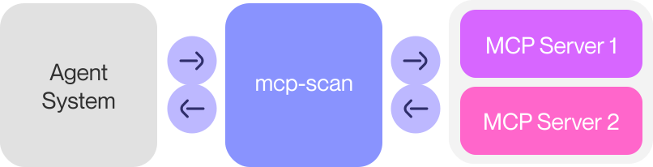
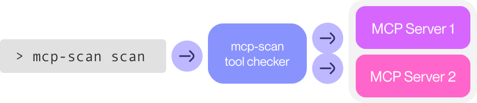

# MCP-Scan: A security scanner for MCP

<div class='subtitle'>
Use MCP-scan to safeguard your MCP integrations.
</div>

[MCP-scan](https://github.com/invariantlabs-ai/mcp-scan) is a security scanning tool that uses Invariant's security stack to ensure the MCP integrations you are using in MCP clients, such as Cursor, Claude, and Windsurf are safe.



### MCP-Scan Features

- Scanning of Claude, Cursor, Windsurf, and other file-based MCP client configurations
- Scanning for prompt injection attacks in tool descriptions and [tool poisoning attacks](https://invariantlabs.ai/blog/mcp-security-notification-tool-poisoning-attacks) using [Guardrails](https://github.com/invariantlabs-ai/invariant?tab=readme-ov-file#analyzer)
- Live runtime monitoring of MCP traffic using `mcp-scan proxy`
- _MCP guardrailing_ of tool calls and responses, including PII detection, secrets detection, tool restrictions, and [custom guardrailing policies](./guardrails)
- Detection of cross-origin escalation attacks ([tool shadowing](https://invariantlabs.ai/blog/mcp-security-notification-tool-poisoning-attacks))
- _Tool Pinning_ to detect and prevent [MCP rug pull attacks](https://invariantlabs.ai/blog/mcp-security-notification-tool-poisoning-attacks), i.e. detects changes to MCP tools via hashing

## Quick Start
To run a simple system-level scan with MCP-Scan, use the following command:

```bash
uvx mcp-scan@latest
```

or

```
npx mcp-scan@latest
```

To learn more about the scan, see the [chapter on scanning](./scanning.md).

## Why MCP-Scan?
As Invariant's [security research on MCP](https://invariantlabs.ai/blog/mcp-security-notification-tool-poisoning-attacks) uncovered ([Tool Poisoning Attacks](https://invariantlabs.ai/blog/mcp-security-notification-tool-poisoning-attacks), [WhatsApp MCP Exploits](https://invariantlabs.ai/blog/whatsapp-mcp-exploited)), MCP implementations across various platforms—such as Cursor, Claude Desktop, Zapier, and others—are susceptible to dangerous attacks. These vulnerabilities include prompt injections, hidden malicious tool instructions (tool poisoning), and cross-origin escalations through tool shadowing.

Recognizing these serious security threats, we developed **MCP-Scan** to help users quickly identify vulnerabilities within their MCP installations, ensuring safer and more secure agent interactions.

## Using MCP-Scan

MCP-scan offers two primary modes of operations, allowing you to identify security vulnerabilities in your MCP integrations and continuously monitor your MCP traffic.


<!-- * [_Server Scanning_](./scanning.md) with **`mcp-scan scan`** -->
### Passive Scanning with **`mcp-scan scan`**
    
Using `mcp-scan scan`, you can scan your configured MCP servers for malicious tool descriptions and behavior, in order to prevent attacks from untrusted MCP servers. `mcp-scan scan` is a static check that only runs when you invoke it, and does not run in the background.

<br/>



<br/>

Learn more about the scanning mode in the [MCP Server Scanning](./scanning.md) chapter.


### Active Proxying with **`mcp-scan proxy`**
    
Using `mcp-scan proxy`, you can monitor, log, and safeguard all MCP traffic on your machine. This allows you to inspect the runtime behavior of agents and tools, and prevent attacks from e.g., untrusted sources (like websites or emails) that may try to exploit your agents. `mcp-scan proxy` is a dynamic security layer that runs in the background, and continuously monitors your MCP traffic.

<br/>


<br/>

Learn more about the proxying mode in the [MCP Proxying with mcp-scan](./proxying.md) chapter.


## Including MCP-scan results in your own project / registry

If you want to include MCP-scan results in your own project or registry, please reach out to the team via `mcpscan@invariantlabs.ai`, and we can help you with that.
For automated scanning, we recommend using the `--json` flag and parsing the output.

## Further Reading
- [Introducing MCP-Scan](https://invariantlabs.ai/blog/introducing-mcp-scan)
- [MCP Security Notification Tool Poisoning Attacks](https://invariantlabs.ai/blog/mcp-security-notification-tool-poisoning-attacks)
- [WhatsApp MCP Exploited](https://invariantlabs.ai/blog/whatsapp-mcp-exploited)
- [MCP Prompt Injection](https://simonwillison.net/2025/Apr/9/mcp-prompt-injection/)


## Next Steps

If you are interested in learning more about securing MCP and agents more generally, consider reading one of the following chapters next.

<div class='tiles'>

<a href="./scanning" class='tile primary'>
    <span class='tile-title'>MCP Server Scanning →</span>
    <span class='tile-description'>Scans your configured MCP servers for malicious tool descriptions and behavior.</span>
</a>

<a href="./proxying" class='tile primary'>
    <span class='tile-title'>MCP Proxying with mcp-scan</span>
    <span class='tile-description'>Monitors, logs, and safeguards all MCP traffic on your machine.</span>
</a>

<a href="../guardrails/" class='tile'>
    <span class='tile-title'>Guardrails →</span>
    <span class='tile-description'>Learn the fundamentals about guardrailing with Invariant.</span>
</a>

<a href="../explorer/" class='tile'>
    <span class='tile-title'>Explorer →</span>
    <span class='tile-description'>Configure your guardrailing rules in Explorer, and visualize agent behavior.</span>
</a>

</div>
