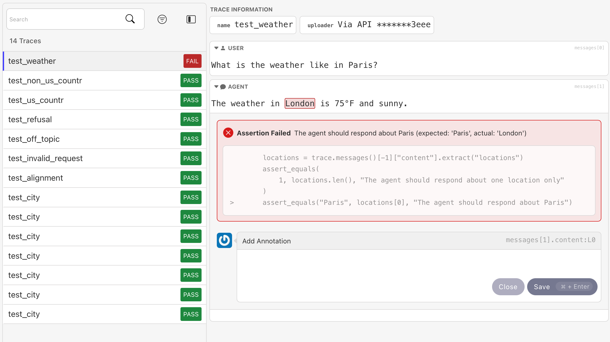

# Invariant `testing`: helps you build better AI agents through debuggable unit testing

Invariant `testing` is a lightweight library to write and run AI agent tests. It provides helpers and assertions that enable you to write robust tests for your agentic applications.

Using [**localized assertions**](writing/traces.ipynb), `testing` always points you to the exact part of the agent's behavior that caused a test to fail, making it easy to debug and resolve issues (_think: stacktraces for agents_).


<br/>


## Installation

```
pip install invariant-ai
```

## A quick example

The example below uses `extract(...)` to detect `locations` from messages. This uses the `gpt-4o` model from OpenAI.

Setup your OpenAI key as

```bash
export OPENAI_API_KEY=<your-key>
```

```python
# content of tests/test_weather.py
import invariant.testing.functional as F
from invariant.testing import Trace, assert_equals

def test_weather():
    # create a Trace object from your agent trajectory
    trace = Trace(
        trace=[
            {"role": "user", "content": "What is the weather like in Paris?"},
            {"role": "agent", "content": "The weather in London is 75°F and sunny."},
        ]
    )

    # make assertions about the agent's behavior
    with trace.as_context():
        # extract the locations mentioned in the agent's response
        locations = trace.messages()[-1]["content"].extract("locations")

        # assert that the agent responded about Paris and only Paris
        assert_equals(1, F.len(locations), 
            "The agent should respond about one location only")

        assert_equals("Paris", locations[0], "The agent should respond about Paris")

```

**Execute it on the command line**:

```py
$ invariant test
________________________________ test_weather _________________________________
ERROR: 1 hard assertions failed:

 
    # assert that the agent responded about Paris and only Paris
    assert_equals(1, F.len(locations), 
        "The agent should respond about one location only")
    
>   assert_equals("Paris", locations[0], "The agent should respond about Paris")
________________________________________________________________________________

ASSERTION FAILED: The agent should respond about Paris (expected: 'Paris', actual: 'London')
________________________________________________________________________________

#       role:  "user"
#       content:  "What is the weather like in Paris?"
#     },
#     {
#       role:  "agent"
        content:   "The weather in London is 75°F and sunny."
#     },
#  ]
```
The test result provides information about which assertion failed but also [localizes the assertion failure precisely](writing/tests.md) in the provided list of agent messages.

**Visual Test Viewer (Explorer):**

As an alternative to the command line, you can also [visualize test results](running/visual-debugging.md) on the [Invariant Explorer](https://explorer.invariantlabs.ai/):

```py
$ invariant test --push
```



Like the terminal output, the Explorer highlights the relevant ranges, but does so even more precisely, marking the exact words that caused the assertion to fail.

## Features

* Comprehensive [`Trace` API](writing/traces.ipynb) for easily navigating and checking agent traces.
* [Assertions library](writing/matchers.md) to check agent behavior, including fuzzy checkers such as _Levenshtein distance_, _semantic similarity_ and _LLM-as-a-judge_ pipelines.
* Full [`pytest` compatibility](running/pytest-compatibility.md) for easy integration with existing test and CI/CD pipelines.
* Parameterized tests for [testing multiple scenarios](writing/parameterized-tests.md) with a single test function.
* [Visual test viewer](running/visual-debugging.md) for exploring large traces and debugging test failures.

## Next Steps

* [Quickstart Guide](quickstart.md)
